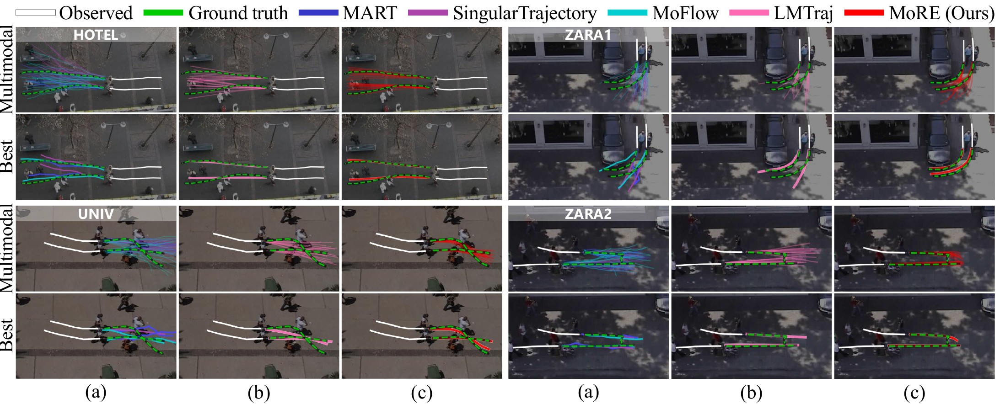
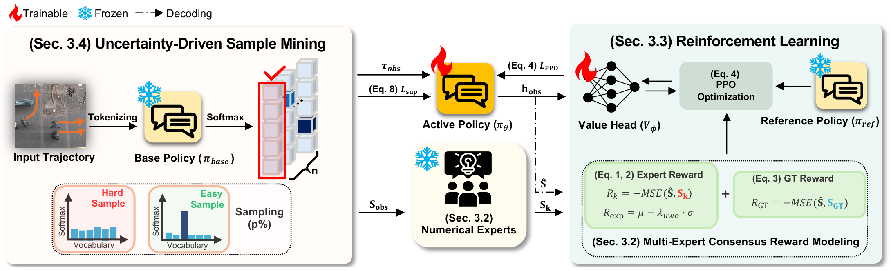

<h2 align="center">Revisiting Numerical Forecasting Models for<br>Language-Based Trajectory Prediction</h2>

<p align="center">
  <a href="https://jungyu0413.github.io/"><strong>JunGyu Lee</strong></a><sup>1</sup>
  &nbsp;·&nbsp;
  <a href="https://ihbae.com/inhwanbae"><strong>Inhwan Bae</strong></a><sup>2</sup>
  &nbsp;·&nbsp;
  <a href="https://scholar.google.co.kr/citations?user=Ei00xroAAAAJ&hl=ko"><strong>Hae-Gon Jeon</strong></a><sup>1</sup>
  <br>
  <sup>1</sup>Yonsei University &nbsp;&nbsp; <sup>2</sup>DGIST
</p>

<p align="center">
  <a href="https://jungyu0413.github.io/MoRE/"><strong><code>Project Page</code></strong></a>
  <a href="#"><strong><code>arXiv (coming soon)</code></strong></a>
  <a href="https://github.com/jungyu0413/MoRE"><strong><code>Source Code</code></strong></a>
  <a href="#-citation"><strong><code>Citation</code></strong></a>
</p>

<div align="center">
  <br>
  <br><em>(a) Numerical baselines produce scattered samples; (b) LMTraj produces consistent but offset samples;
  (c) MoRE refines the language-based predictions with numerical feedback.</em>
</div>

<br>

**Summary:** **MoRE** (**M**ixture **O**f **R**eward **E**xperts) transfers numerical forecasting priors into a
pretrained **language-based trajectory predictor** through **reinforcement learning**. Five frozen numerical
predictors act as reward experts during training only, so inference memory and latency stay the same as the base
language model.

<br>

## 🧭 Overview

Language-based trajectory predictors represent coordinates as discrete tokens and learn auxiliary tasks such as
destination and group reasoning, which captures behavioral intent and social context. Token-level objectives,
however, give only indirect guidance on continuous coordinate-space accuracy. MoRE closes this gap:

* **Multi-expert consensus reward.** Five frozen numerical predictors (Social-STGCNN, DMRGCN, GP-Graph,
  SingularTrajectory, Expert-Trajectory) score each decoded trajectory, $R_k = -\mathrm{MSE}(\hat{S}, S_k)$.
  An uncertainty-weighted consensus $R_{\text{exp}} = \mu - \lambda_{\text{uwo}}\,\sigma$ penalizes expert
  disagreement, and a ground-truth reward $R_{\text{GT}}$ anchors the prediction.
* **PPO refinement.** The policy is refined with PPO, interleaved with supervised learning, using a LoRA adapter
  (rank 16, 0.3% of the parameters).
* **Uncertainty-driven sample mining.** Refinement focuses on the top 1% of training samples ranked by the
  predictive entropy of the frozen base policy.
* **No inference overhead.** Expert predictions are computed once and cached before training; only the refined
  language-based predictor is used at test time.

<div align="center">
  
  <br><em>MoRE training pipeline.</em>
</div>

<br>

## 📊 Results

Best-of-20 ADE / FDE reported in the paper (Table 1). ETH-UCY in meters, SDD and GCS in pixels.

| Model | ETH | HOTEL | UNIV | ZARA1 | ZARA2 | AVG | SDD | GCS |
|:--|:-:|:-:|:-:|:-:|:-:|:-:|:-:|:-:|
| SingularTrajectory | 0.35/0.42 | 0.13/0.19 | 0.25/0.44 | 0.19/0.32 | 0.15/0.25 | 0.21/0.32 | 7.58/12.1 | 7.9/13.3 |
| MoFlow | 0.40/0.57 | 0.11/0.17 | 0.23/0.39 | 0.15/0.26 | 0.12/0.22 | 0.20/0.32 | 7.5/12.0 | 9.1/11.6 |
| LMTraj-SUP | 0.41/0.50 | 0.12/0.16 | 0.22/0.34 | 0.20/0.32 | 0.17/0.27 | 0.22/0.32 | 7.8/10.1 | 7.1/9.6 |
| **MoRE (Ours)** | **0.36/0.42** | **0.11/0.14** | **0.21/0.32** | **0.18/0.28** | **0.17/0.26** | **0.20/0.29** | **6.4/9.5** | **6.8/8.5** |

Inference memory and latency are unchanged from the base policy (1,401 MB, 18.3 ms on an RTX 4090).
See the paper and the [project page](https://jungyu0413.github.io/MoRE/) for the full comparison.

<br>

## 🛠️ Setup

**Environment.** Python ≥ 3.9 and PyTorch ≥ 2.0. Install the dependencies with

```bash
git clone https://github.com/jungyu0413/MoRE.git && cd MoRE
pip install -r requirements.txt
```

> [!IMPORTANT]
> Use `transformers < 5`. Version 5 mis-tokenizes the trajectory SentencePiece model (pieces containing a comma
> become `<unk>`), which silently breaks both training and evaluation.

**Distributed training.** Training and evaluation run through 🤗 `accelerate`:

```bash
accelerate config
```

**Dataset.** We use [ETH](https://data.vision.ee.ethz.ch/cvl/aem/ewap_dataset_full.tgz) and
[UCY](https://graphics.cs.ucy.ac.cy/research/downloads/crowd-data) with the train/val/test splits of
[Social-GAN](https://github.com/agrimgupta92/sgan). The ready-to-use split with the homographies and scene
images/captions is released in [LMTrajectory](https://github.com/InhwanBae/LMTrajectory); copy its `datasets/`
folder to `dataset_path` in `configs/default.json` (`./datasets` by default):

```
datasets/
├── eth/{train,val,test}/*.txt      # also hotel/, univ/, zara1/, zara2/
├── homography/*_H.txt
└── image/*_reference.png, *_oracle.png, *_caption.txt
```

Then build the prompt/answer files the model trains on:

```bash
bash scripts/prepare_dataset.sh configs/default.json eth hotel univ zara1 zara2
```

This writes `datasets/preprocessed/*.json`. The train split carries all six question types (forecast,
destination, direction, group, collision, mimicry) with augmentation; val and test carry forecast only.

**Expert models (training only).** Clone the five expert repositories into `./workspace` and download their
ETH/UCY checkpoints. The exact checkpoint paths MoRE loads and the config keys to override them are listed in
[workspace/README.md](workspace/README.md). Evaluation does not need the experts.

<br>

## 🔥 Training

**1. Cache expert predictions** (once per dataset):

```bash
bash scripts/prepare_experts.sh configs/default.json train  eth
bash scripts/prepare_experts.sh configs/default.json val    eth
```

**2. Cache sample-mining entropies** (optional; computed on the fly otherwise):

```bash
accelerate launch -m more.prepare_mining --config_file configs/default.json --dataset_name eth
```

**3. Refine with PPO:**

```bash
bash scripts/train.sh eth                 # dataset: eth | hotel | univ | zara1 | zara2
bash scripts/train.sh eth my-experiment   # optional run tag
```

All hyperparameters (experts, rewards, PPO, mining, LoRA) are in [configs/default.json](configs/default.json).
The defaults follow the paper:

| Component | Setting |
|:--|:--|
| Base policy | LMTraj-SUP (T5-small), LoRA r = 16, α = 32 |
| Reward | $\lambda_{\text{exp}}$ = 0.5 (`rl_ensemble_weight`), $\lambda_{\text{uwo}}$ = 0.05 (`rl_uwo_lambda`) |
| PPO | clip ε = 0.2, value coef. 0.5, KL β = 0.1, RL loss weight 0.5, one PPO update every 10 supervised steps |
| Mining | top 1% by predictive entropy (`mining_percentile` = 99) |
| Optimizer | AdamW, lr 1e-4 |

<br>

## 🚀 Inference

MoRE draws N = 1000 samples per pedestrian and reports best-of-20 after K-means clustering. At inference, the
N samples are **split evenly over several versions of the input prompt**: geometric transforms of the pixel
coordinates (point flip, x/y swap) and the prompt with and without the scene caption. Every decoded trajectory
is mapped back to the original frame with the inverse transform, and the pooled samples go through the usual
post-processing (abnormal-motion filter, wall avoidance, K-means). The model, N and K stay the same.

| Dataset | Prompt variants | Samples per variant |
|:--|:--|:-:|
| ETH, HOTEL, UNIV, ZARA1 | {original, flip, swap, flip + swap} × {with, without scene caption} | 125 |
| ZARA2 | {original, flip, swap, flip + swap} | 250 |

Implementation: [`more/inference/tta.py`](more/inference/tta.py); details in [docs/INFERENCE.md](docs/INFERENCE.md).
Generation also uses a copy-free T5 attention for cached decoding (about 2× faster, identical outputs;
`--no_fast_attention` disables it).

```bash
# pretrained weights for a dataset (from ./weights)
accelerate launch -m more.evaluate --config_file configs/default.json --dataset_name univ

# your own checkpoint
bash scripts/evaluate.sh configs/default.json checkpoint/<run>/best_model <tag> zara1

# a LoRA adapter on its base model (merged before evaluation)
accelerate launch -m more.evaluate --config_file configs/default.json \
    --checkpoint <base_model> --lora <adapter_dir> --dataset_name univ
```

**Pretrained weights.** Pretrained MoRE weights will be released on the
[release page](https://github.com/jungyu0413/MoRE/releases). Place them under `./weights`
(see [weights/README.md](weights/README.md)).

<br>

## 🗂️ Code Structure

<details>
<summary>Click to expand</summary>

```
MoRE/
├── more/
│   ├── train.py               # supervised + PPO refinement loop
│   ├── evaluate.py            # inference with test-time augmentation, best-of-K ADE/FDE
│   ├── prepare_dataset.py     # raw ETH/UCY → prompt/answer files
│   ├── prepare_experts.py     # cache expert predictions
│   ├── prepare_mining.py      # cache predictive entropies
│   ├── mining.py              # uncertainty-driven sample mining
│   ├── rl/                    # PPO loss & value head (ppo.py), consensus reward (rewards.py)
│   ├── experts/               # expert loading/inference (registry.py) and caching (predictions.py)
│   ├── inference/             # test-time augmentation (tta.py), fast T5 attention (fast_t5.py)
│   ├── data/                  # prompt conversion, preprocessing, homography, post-processing, collator
│   └── utils/                 # config, dataloader, expert wrappers, helpers
├── configs/default.json       # all hyperparameters
├── scripts/                   # prepare_dataset / prepare_experts / train / evaluate
├── workspace/README.md        # expert repositories and checkpoint paths
├── weights/README.md          # evaluation weights layout
└── docs/                      # project page and INFERENCE.md
```

</details>

<br>

## 📖 Citation

If you find this code useful, please cite our paper:

```bibtex
@article{lee2026more,
  title   = {Revisiting Numerical Forecasting Models for Language-Based Trajectory Prediction},
  author  = {Lee, JunGyu and Bae, Inhwan and Jeon, Hae-Gon},
  journal = {arXiv preprint},
  year    = {2026}
}
```

<br>

## 📄 License

This code is released under the [CC BY-NC 4.0](LICENSE) license, matching
[LMTrajectory](https://github.com/InhwanBae/LMTrajectory), from which parts of this code are borrowed.

## 🙏 Acknowledgement

Parts of our code are borrowed from [LMTrajectory](https://github.com/InhwanBae/LMTrajectory),
[GP-Graph](https://github.com/InhwanBae/GPGraph), [DMRGCN](https://github.com/InhwanBae/DMRGCN),
[SingularTrajectory](https://github.com/InhwanBae/SingularTrajectory),
[Social-STGCNN](https://github.com/abduallahmohamed/Social-STGCNN) and
[Expert-Traj](https://github.com/JoeHEZHAO/expert_traj). We thank the authors for releasing their code and models.
